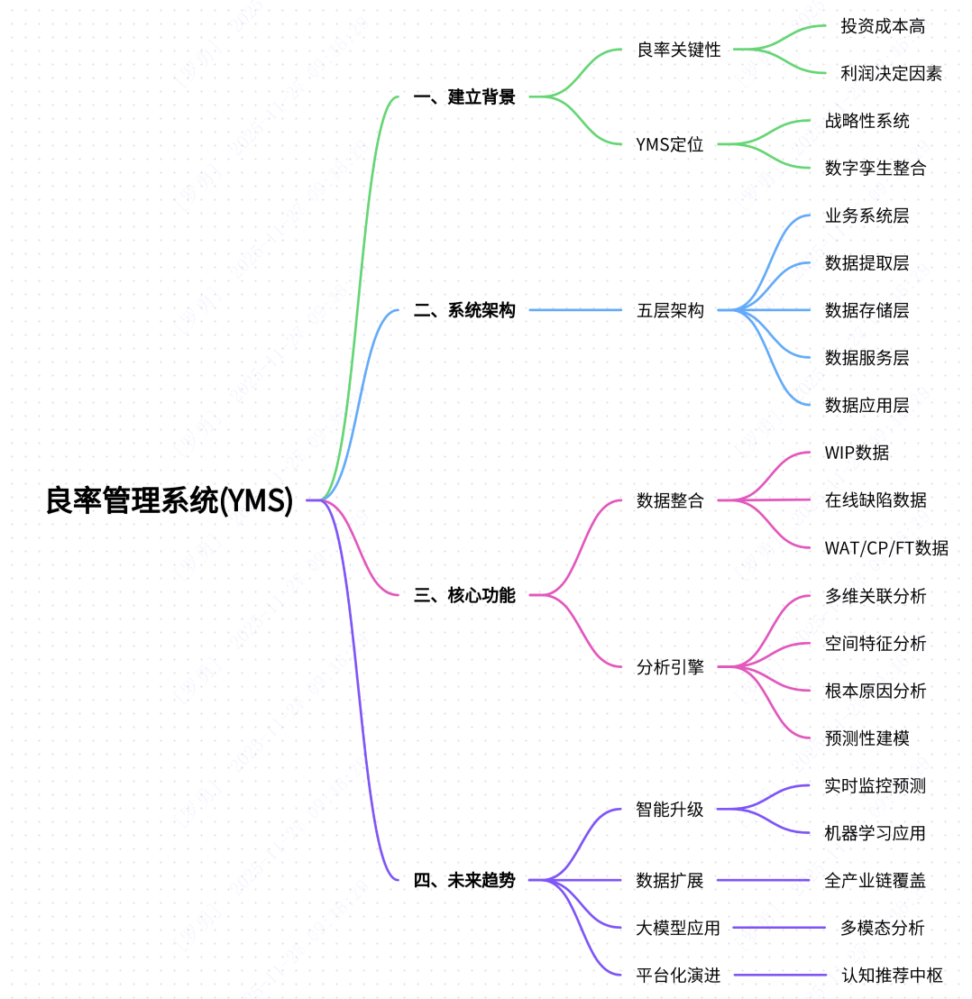

# 半导体制造中的YMS系统是什么？

良率管理系统（Yield Management System，YMS）是半导体制造中用于提升产品良率的核心工业软件系统。以下是对其背景、系统架构、核心功能及未来发展的详细总结：

# 一、YMS的建立背景

良率的重要性：半导体晶圆厂投资巨大（可达100-200亿美元），年运营成本高昂，良率直接决定企业利润和竞争力。
YMS的定位：不仅是报表工具，而是整合全流程数据、构建制造过程数字孪生的战略性系统，旨在实现：

良率损失的根本原因分析；
预测性维护；
系统性优化生产流程。

## 二、系统架构与数据处理流程
YMS采用五层分层架构，实现从原始数据到决策支持的转化：

业务系统层

数据来源：包括晶圆针测（CP）、晶圆允收测试（WAT）、成品测试（FT）、在制品信息（WIP）、设备历史记录（EQP His）、工程数据收集（EDC）等。

数据提取与解析层  

功能：通过周期抽取或实时解析，将底层数据高效传输至中央数据库。

业务数据与基础数据层  

功能：作为中央数据仓库，存储并管理所有生产数据及维度信息。

数据服务层

功能：通过高性能接口（如GRPC）提供标准化数据查询服务，确保应用层安全访问数据。

数据应用层

功能：为用户提供可视化界面，支持报表生成、统计分析、晶圆图展示等，辅助工程师诊断问题与决策。

## 三、核心功能与数据分析方法
1. 核心数据整合

WIP数据：记录晶圆在产线中的时空坐标，作为数据分析索引。
在线与缺陷数据：实时监控工艺过程。
WAT数据：连接物理制造与电性表现。
CP数据：直接量化良率，生成晶圆图以识别空间分布特征。
FT数据：评估封装后芯片性能。

2. 分析引擎功能

多维关联分析：关联良率异常与上游工艺参数漂移。
空间特征分析：通过晶圆图识别缺陷分布模式。
根本原因分析：追溯问题根源至具体工艺步骤。
预测性建模：提前预警良率下降趋势。
其他工具：统计过程控制（SPC）、缺陷分析、先进过程控制（APC）等，结合自动化报告提升效率。

## 四、未来发展趋势

智能化升级

从事后分析转向实时监控、智能预测与自动诊断。
应用机器学习预测良率趋势，实现预警和根因自动推荐。

数据范围扩展

从工厂内部延伸至全产业链（设计、原材料、封装测试、应用端），实现全链路良率追溯。

多模态大模型应用  

支持非结构化数据（如图像、文本、声波）分析，增强诊断能力。

平台化演进

YMS将成为智能制造的核心中枢，通过认知推荐功能提供优化建议，助力企业保持竞争力。

## 总结
YMS是半导体制造中不可或缺的系统，通过整合多源数据、深度分析和可视化工具，系统性提升良率并降低成本。未来结合AI与全链路数据，将进一步演进为智能决策平台，推动半导体产业向高效、精准化方向发展。

[参考文献link](https://github.com/yangyangwithcat/yangyangwithcat.github.io/blob/master/pictures/2025-11-26/%E5%8F%82%E8%80%83%E6%96%87%E7%8C%AE.png?raw=true)

以下是基于您提供的文档内容，按“抬头三问”（是什么、为什么、怎么办）框架进行的总结：
一、YMS是什么？
良率管理系统（Yield Management System, YMS）是半导体制造中的核心工业软件，它通过集成全流程数据（涵盖设计、晶圆制造、封装测试等环节），提供数据管理、分析与可视化功能，帮助工程师快速定位良率问题、优化生产流程。其核心定位是构建制造过程的数字孪生模型，而非简单的报表工具。
系统架构与数据处理流程
YMS采用五层分层架构，实现数据从采集到决策支持的转化：

业务系统层：数据来源层，包括晶圆针测（CP）、晶圆允收测试（WAT）、成品测试（FT）、在制品信息（WIP）等。
数据提取与解析层：通过周期抽取或实时解析（如多线程技术）将数据高效搬运至中央数据库。
业务数据与基础数据层：中央数据仓库，存储并管理所有生产数据。
数据服务层：通过高性能接口（如GRPC）提供标准化数据查询服务。
数据应用层：用户交互界面，提供报表生成、晶圆图展示、统计分析等功能。

二、为什么需要YMS？
核心必要性

成本与竞争压力：晶圆厂投资巨大（可达100–200亿美元），年运营成本高昂，良率直接决定企业盈利能力和市场竞争力。良率损失可能导致严重财务损失。
问题定位效率：半导体制造流程复杂，良率问题涉及多环节（工艺、设备、材料等）。YMS通过多维数据关联分析（如将CP良率异常与上游WAT参数关联），快速定位根本原因，避免传统人工排查耗时过长。

解决的核心痛点

数据孤岛：WAT、CP、FT等数据分散于不同系统，格式不统一，YMS实现自动整合与标准化。
分析滞后性：传统方法依赖事后分析，YMS支持实时监控与预测性预警（如通过SPC监控参数漂移）。
工程效率低下：无YMS时，工程师需花费80%时间处理数据，仅20%用于分析；YMS通过自动化数据治理逆转这一比例。

三、YMS如何发挥作用？
核心功能模块

数据整合与标准化

支持多源数据（如设备传感器、测试平台ASL1000/MS7000等）的自动采集与格式统一，消除分析盲区。

智能分析工具

SPC（统计过程控制）：实时监控工艺参数，发现异常并预警。
缺陷与良率分析：通过晶圆地图（Wafer Map）识别空间缺陷模式，结合BIN分析定位失效芯片。
根本原因分析（RCA）：自动关联CP良率下降与特定WAT参数异常，追溯至具体工艺设备。

预测与优化

基于机器学习预测良率趋势（如设备参数偏移导致未来缺陷），并提供优化建议（如调整工艺参数）。

关键技术支撑

AI与多模态大模型：处理非结构化数据（如设备日志、声波信号），实现智能诊断。
分布式数据库：支持10TB级以上数据存储，确保高并发查询效率。

实际应用案例
某Fabless公司NOR Flash产品CP良率仅85%，通过YMS的相关性分析发现WAT中某电阻值与漏电流强相关，根因为金属化工艺设备参数偏移。优化后，3周内良率提升至95%，漏电流失效降低82%。
未来演进方向
YMS正从"事后分析工具"向全链路智能平台进化：

预测性维护：AI提前预警良率风险。
全生命周期覆盖：整合设计、原材料、封装测试乃至终端数据，实现端到端追溯。
认知推荐：基于历史数据自动提供工艺优化方案（如"将A设备参数上调2%"）。

总结
YMS是半导体制造中不可或缺的战略系统，通过数据驱动的方法系统性提升良率、降低成本。未来与AI、全链路数据融合后，将进一步成为智能制造的核心决策中枢。