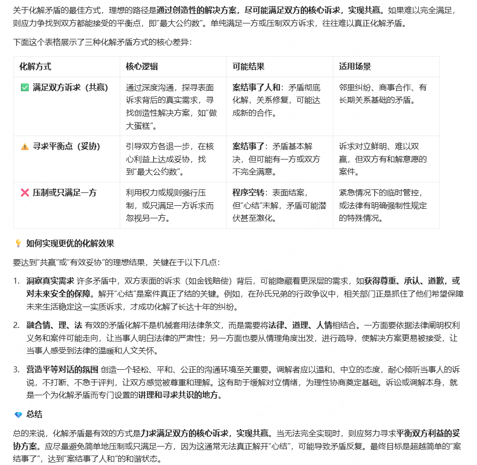

- 关于化解矛盾的最佳方式

关于化解矛盾的最佳方式，理想的路径是通过创造性的解决方案，尽可能满足双方的核心诉求，实现共赢。如果难以完全满足，则应力争找到双方都能接受的平衡点，即“最大公约数”。单纯满足一方或压制双方诉求，往往难以真正化解矛盾。
下面这个表格展示了三种化解矛盾方式的核心差异：

化解方式核心逻辑可能结果适用场景✅ 满足双方诉求（共赢）通过深度沟通，探寻表面诉求背后的真实需求，寻找创造性解决方案，如“做大蛋糕”。案结事了人和：矛盾彻底化解，关系修复，可能达成新的合作。邻里纠纷、商事合作、有长期关系基础的矛盾。⚠️ 寻求平衡点（妥协）引导双方各退一步，在核心利益上达成妥协，找到“最大公约数”。案结事了：矛盾基本解决，但可能有一方或双方不完全满意。诉求对立鲜明、难以双赢，但双方有和解意愿的案件。❌ 压制或只满足一方利用权力或规则强行压制，或只满足一方诉求而忽视另一方。程序空转：表面结案，但“心结”未解，矛盾可能潜伏甚至激化。紧急情况下的临时管控，或法律有明确强制性规定的特殊情况。
💡 如何实现更优的化解效果
要达到“共赢”或“有效妥协”的理想结果，关键在于以下几点：

洞察真实需求
许多矛盾中，双方表面的诉求（如金钱赔偿）背后，可能隐藏着更深层的需求，如获得尊重、承认、道歉，或对未来安全的保障。解开“心结”是案件真正了结的关键。例如，在孙氏兄弟的行政争议中，相关部门正是抓住了他们希望保障未来生活稳定这一实质诉求，才成功化解了长达十年的纠纷。

融合情、理、法
有效的矛盾化解不是机械套用法律条文，而是需要将法律、道理、人情相结合。一方面要依据法律阐明权利义务和案件可能走向，让当事人明白法律的严肃性；另一方面也要从情理角度出发，进行疏导，使解决方案更易被接受，让当事人感受到法律的温暖和人文关怀。

营造平等对话的氛围
创造一个轻松、平和、公正的沟通环境至关重要。调解者应以温和、中立的态度，耐心倾听当事人的诉说，不打断、不急于评判，让双方感觉被尊重和理解。这有助于缓解对立情绪，为理性协商奠定基础。诉讼或调解本身，就是一个为化解矛盾而专门设置的讲理和寻求共识的地方。

💎 总结
总的来说，化解矛盾最有效的方式是力求满足双方的核心诉求，实现共赢。当无法完全实现时，则应努力寻求平衡双方利益的妥协方案。应尽量避免简单地压制或只满足一方，因为这通常无法真正解开“心结”，可能导致矛盾反复。最终目标是超越简单的“案结事了”，达到“案结事了人和”的和谐状态。
希望这些信息能帮助你更好地理解矛盾化解的艺术。如果你有更具体的矛盾场景想探讨，我很乐意提供更细致的分析。