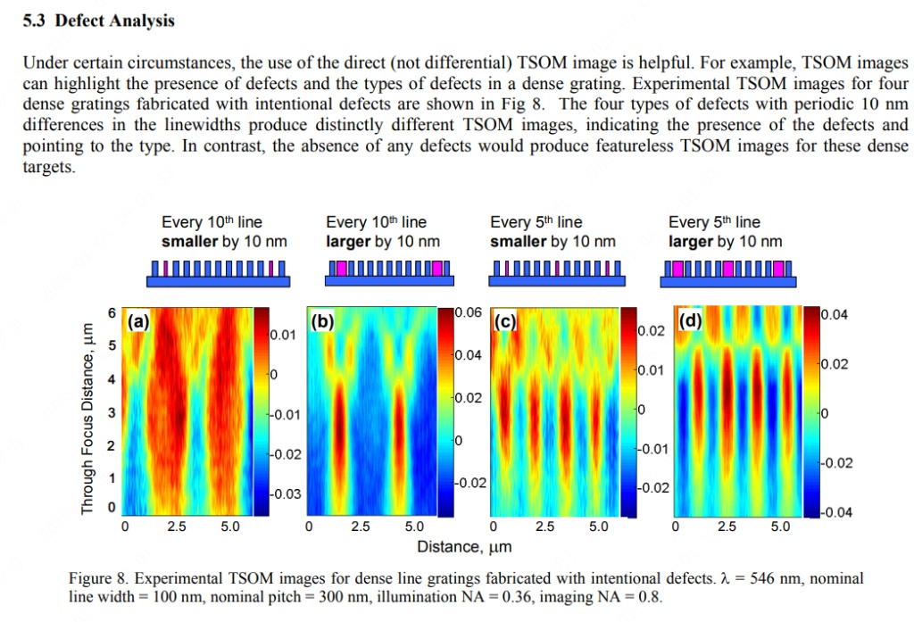

# 从数学角度分析下次图像看缺陷分析的逻辑

从数学和信号处理的角度来看，TSOM（离焦扫描光学显微术）对缺陷的分析逻辑，本质上是一个**“空间频率滤波”**与**“相位-强度转换”**的过程。

我们可以将图像中的现象拆解为以下几个数学逻辑步骤：

### 1. 信号分解：载波与包络 (Carrier vs. Envelope)

首先，我们将光栅看作一个一维的空间函数 。

* **理想光栅 (载波)**：是一个高频周期函数。

其中基频 。在本例中，，这是一个非常高的空间频率。由于显微镜的光学分辨率限制（衍射极限 ），这个高频载波可能接近截止频率，成像时往往只表现为均匀的背景灰度（直流分量 DC）。
* **缺陷函数 (调制波)**：
缺陷并不是随机的，而是周期性出现的（每10条或每5条）。这引入了一个新的、低频的“调制信号” 。
* 图 (a)/(b) 的缺陷周期：。频率 。
* 图 (c)/(d) 的缺陷周期：。频率 。

**数学结论 1：** 光学系统可能看不清 300 nm 的单根线条，但能轻松“看清” 3000 nm 或 1500 nm 的宏观周期变化。**TSOM 图像实际上是在对这个低频的“缺陷包络”进行成像。**

### 2. 差分与线性叠加 (Linearity & Contrast)

图谱颜色的深浅代表光强  的变化。对于微小缺陷，我们可以使用**微扰理论**近似。

设光场 ，其中  是理想光栅的背景场， 是缺陷产生的散射场。
探测到的强度为：

*  是常数背景。
*  对于微小缺陷可以忽略（二阶小量）。
* **干涉项 ** 是主导项。

**数学结论 2 (正负相关性)：**

* **图 (a) vs 图 (b)**：
* (a) 线宽减小 ()，相当于在原位置叠加了一个“负”的散射场 。
* (b) 线宽增加 ()，相当于叠加了一个“正”的散射场 。
* 这导致干涉项符号翻转。因此，图 (a) 中的红色高亮区域（强度增强），在图 (b) 中变成了蓝色深陷区域（强度减弱）。数学上表现为**相位的  翻转**。

### 3. Z轴的频域演化 (Through-Focus Evolution)

为什么图像在纵轴（Z轴）上会呈现出拉长的“纺锤形”或震荡条纹？这涉及光在传播过程中的**菲涅尔衍射 (Fresnel Diffraction)**。

在频域中，光沿 Z 轴传播相当于乘以一个传递函数 ：

*  的变化引入了随空间频率  平方的**相位因子变化**。
* 这种相位变化会将物体的幅度信息转化为强度信息（类似于相衬显微镜原理），并且随着  的增加，不同空间频率的分量会发生干涉相长或相消。

**数学结论 3 (古伊相移 Gouy Phase Shift 的类比)：**
图中的垂直条纹（红色或蓝色斑块）实际上是缺陷产生的散射光在不同离焦平面上的**三维点扩散函数 (3D PSF)** 的切片。

* **周期性重复**：横轴上的重复是因为缺陷本身是周期排列的。
* **Z轴拉伸**：表明该缺陷特征具有较长的焦深（Depth of Focus），这通常是低数值孔径（Low NA）成分或低频成分的特征。

### 4. 频率倍增效应 (Frequency Doubling)

对比图 (a)/(b) 与图 (c)/(d)：

* **输入信号频率**：(c) 的缺陷密度是 (a) 的两倍（每5行 vs 每10行）。
* **输出图像频率**：观察 TSOM 图像的横轴，(c) 中亮暗条纹的密集程度显然也是 (a) 的两倍。

这验证了该成像系统在低频段是线性的——输入信号（缺陷分布）的频率直接映射到了输出图像的强度分布频率上。

---

### 总结

从数学逻辑上看，这张图说明了 TSOM 方法实际上是一种**“频谱搬移与放大”**技术：

1. **降频**：利用周期性缺陷形成的**莫尔条纹 (Moiré-like effect)** 或**超晶格 (Super-lattice)** 效应，将无法分辨的高频光栅细节 () 转化为可分辨的低频缺陷信号 ()。
2. **符号敏感**：利用干涉项的线性特性，通过强度的正负（红/蓝）直接判断线宽是变大还是变小（导数的符号）。
3. **Z轴层析**：利用离焦带来的相位演化，增强了对微弱相位物体（由微小尺寸变化引起）的对比度。

### **菲涅尔衍射 (Fresnel Diffraction)：现象与数据分析**

菲涅尔衍射，又称**近场衍射**。简单来说，它是当光经过物体（如微小孔洞、边缘或光栅）后，在**距离物体较近**的区域内形成的复杂光影图案。

与我们熟悉的“夫琅禾费衍射”（远场衍射，如激光笔照出的光斑）不同，菲涅尔衍射的图案**会随着距离（Z轴）的变化而剧烈演变**。

---

### **1. 现象描述：光场的“近身肉搏”**

想象你把一个网格放在手电筒前，然后把一张白纸从网格后面紧贴着慢慢向后移：

* **极近处 (几何投影区)：** 你看到清晰的网格影子（黑白分明）。
* **稍远处 (菲涅尔区)：** 影子的边缘开始模糊，出现明暗相间的条纹。更神奇的是，原本黑色的线条中心可能会亮起来，白色的空隙中心可能会变暗。图案在不断“震荡”变化。
* **极远处 (夫琅禾费区)：** 图案稳定下来，只随距离放大，不再改变形状。

**核心特征：**

* **非保形性：** 衍射图案与原物体形状不完全像（比如圆孔可能衍射出中心亮斑，也可能衍射出中心黑点，取决于距离）。
* **演化性：** 只要 Z 轴（距离）改变一点点，光强分布  就会发生显著变化。

---

### **2. 数学模型：二次相位调制**

从数据分析的角度，菲涅尔衍射可以看作是一个**线性系统**对输入光场进行了一次**卷积**运算。

假设物体的光场分布为 ，传播距离  后的光场  近似为：

其中卷积核  是一个**二次相位因子（Chirp Function）**：

**数据分析含义：**
这个公式告诉我们，光在传播过程中，不同空间位置的相位发生了“弯曲”。这就好比把一张原本平整的图片，放在哈哈镜前不断拉伸和扭曲。

---

### **3. 数据分析逻辑：如何从“光斑”看出“缺陷”？**

回到您之前的 TSOM 缺陷分析，其本质就是对菲涅尔衍射数据的逆向分析。

#### **A. 数据集构建：3D 光强立方体**

我们不再看一张图，而是采集一个数据立方体 。

* **切片 (Slicing)：** 固定 （横向位置），观察 （沿轴向的变化）。这被称为“轴向光强分布”。
* **特征 (Feature)：** 菲涅尔衍射对  极其敏感。一个 10nm 的尺寸变化，会改变波前的曲率，导致在某个特定的  处，干涉条纹发生**相移**或**反转**。

#### **B. 关键分析指标**

在分析衍射图谱时，通常关注以下数学特征：

1. **Talbot 效应 (自成像效应)**：
* **现象**：对于周期性结构（如之前的光栅），在特定的菲涅尔距离 ，光场会“复制”原物体的图像。
* **分析点**：如果您在  处看到的图像模糊或扭曲了，说明周期结构有缺陷。

2. **古伊相移 (Gouy Phase Shift)**：
* **现象**：光束在经过焦点附近时，会产生额外的  相位突变。
* **分析点**：缺陷通常会表现为图谱中颜色的**翻转**（如前图中的红变蓝）。这对应了衍射积分中相位项的正负号变化，直接指示了缺陷是“凸起”还是“凹陷”。

3. **对称性分析 (Symmetry Metric)**：
* **理想情况**：完美的线条衍射图案通常关于焦平面是对称的。
* **缺陷情况**：如果存在侧壁倾斜（Asymmetry），衍射图案在焦前和焦后会呈现不对称性。
* **公式**：

* 如果 ，说明结构有不对称缺陷。

---

### **总结：菲涅尔衍射的数据视角**

| 物理视角 | 数据/算法视角 | 应用价值 |
| --- | --- | --- |
| **近场光波的干涉** | **卷积运算与相位解缠** | **将不可见的微小相位变化（纳米级深度/宽度）转化为可见的强度变化。** |
| **随距离变化的图案** | **沿 Z 轴的时间序列分析** | **通过 Z 轴扫描，哪怕光学分辨率不够，也能通过“光强震荡的节奏”推算出物体尺寸。** |

所以，您看到的那些彩色的“纺锤形”图案，本质上就是**缺陷引起的菲涅尔衍射波，在 Z 轴空间上留下的轨迹**。