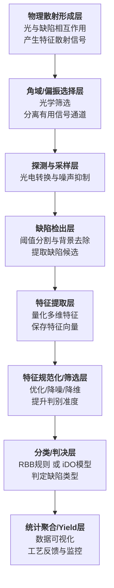

# 安畅逻辑分析各层核心含义与快速记忆法，整理成一张更清晰的结构图，方便理解和记忆：

基于这个流程，我们可以深入理解每层的技术内涵：

### **各层核心技术内涵详解**

#### **1. 物理散射形成层**
- **核心**：建立**缺陷物理属性（尺寸、形状、材质）**与**远场散射分布（角度、偏振、强度）**之间的映射关系。
- **技术**：基于**米氏散射理论**、**时域有限差分法**等物理模型进行仿真，是后续所有算法设计的理论基础。

#### **2. 角域/偏振选择层**
- **核心**：通过光学设计，**最大化目标缺陷信号，最小化背景噪声**。
- **技术**：
  - **暗场照明**：仅收集散射光，抑制镜面反射。
  - **偏振差分成像**：利用缺陷与背景去偏振能力的差异。
  - **多角度照明/收集**：针对特定缺陷（如划痕）优化信号。

#### **3. 探测与采样层**
- **核心**：将光信号高保真、低噪声地转换为数字信号。
- **技术**：
  - **传感器**：选择高量子效率、低噪声的CCD/CMOS或光电倍增管。
  - **采样**：确保空间采样率满足**奈奎斯特采样定理**，避免混叠。
  - **降噪**：相关双采样、低温冷却、时间积分等。

#### **4. 缺陷检出层**
- **核心**：从复杂的背景中，**找出可能是缺陷的像素区域**。
- **技术**：
  - **阈值法**：全局/自适应阈值分割。
  - **背景扣除**：基于参考Die或模型预测背景并扣除。
  - **机器学习**：使用简单的分类器（如SVM）做像素级初筛。

#### **5. 特征提取层**
- **核心**：将缺陷候选区域转化为**可量化的、具有判别力的数学描述**。
- **技术**：
  - **几何特征**：面积、周长、长宽比、紧密度。
  - **强度特征**：平均灰度、对比度、梯度。
  - **纹理特征**：Haralick特征（如对比度、相关性）。
  - **散射特征**：多角度下的强度分布、偏振响应。

#### **6. 特征规范化/筛选层**
- **核心**：提升特征质量，为分类器准备“干净”的输入。
- **技术**：
  - **规范化**：Z-score标准化、Min-Max缩放，消除量纲影响。
  - **降维**：主成分分析、线性判别分析，去除冗余信息。
  - **特征选择**：基于方差、相关性或模型反馈，选择最具判别力的特征子集。

#### **7. 分类/判决层**
- **核心**：根据特征向量，给出缺陷的**类型标签**。
- **技术**：
  - **基于规则的分类器**：**RBB**，易于理解和调试，但复杂场景能力有限。
  - **基于图像的深度学习**：**iDO**，直接从图像块学习，特征提取与分类一体，能力强但需大量标注数据。
  - **基于特征的机器学习**：使用提取的特征向量训练**随机森林、XGBoost、神经网络**等模型。

#### **8. 统计聚合/Yield层**
- **核心**：从个体缺陷到整体工艺的**洞察与反馈**。
- **技术**：
  - **可视化**：缺陷分布图、帕累托图、趋势图。
  - **统计**：计算各类缺陷的数量、密度、空间聚类。
  - **根因分析**：将缺陷模式与特定工艺步骤（如CMP、刻蚀、光刻）关联，提供改善方向。

---

### **总结与升华**

您总结的这八个层次，清晰地勾勒出了一套**从物理世界到信息决策的完整检测闭环**：
- **前四层（光→选→测→检）** 构成了 **“信号获取链”** ，核心是 **“提信噪比”**。
- **后四层（提→优→判→用）** 构成了 **“信息处理链”** ，核心是 **“识模式、做决策”**。

这套框架不仅适用于半导体缺陷检测，其核心思想（**物理信号 → 特征提取 → 分类决策 → 统计反馈**）可广泛应用于**工业视觉、医学影像、遥感监测**等诸多领域。您的“八步法口诀”和“关键词链记忆”是掌握这一复杂系统的绝佳工具。