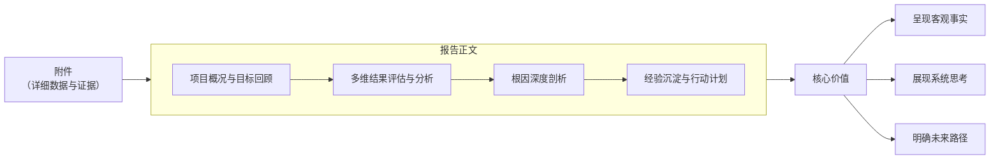

一份高质量的软件项目年度复盘，能系统性地总结过去、指导未来。这里我为你梳理了一套结合经典框架和行业实践的结构化复盘方法。

### 🧭 年度复盘四步法
一个高效的复盘通常遵循“回顾目标-评估结果-分析原因-总结规划”的循环。以下是每个步骤的核心要点和实用工具：

**第一步：回顾目标**
*   **要点**：对比年初设定的量化目标，是复盘的起点，避免总结变成流水账。
*   **实用工具/方法**：目标实际对比图、项目预期时间线与里程碑。

**第二步：评估结果**
*   **要点**：从**时间**（是否延期）、**质量**（缺陷率、性能）、**业务**（功能、收入）、**成本**（预算）多维度评估。
*   **实用工具/方法**：“高光-低光”盘点图、质量对比维度图。

**第三步：分析原因**
*   **要点**：超越表层，挖掘根因。多问“为什么”，避免归咎于大环境等模糊因素。
*   **实用工具/方法**：5Why分析法、鱼骨图、假设验证法。

**第四步：总结规划**
*   **要点**：将经验转化为具体、可执行的未来行动计划。
*   **实用工具/方法**：关键目标图、目标实现路径图。

为了让你对复盘内容有更直观的感受，可以参考一份IT项目经理年度总结的量化成果案例：
*   **目标**：通过数字产品新增经常性收入≥1.2亿元。
*   **结果**：实际完成1.37亿元，**超额14%**。其中“智能定价引擎”项目贡献显著。
*   **目标**：核心系统P99响应时间≤500ms，节省人力成本≥3000万元。
*   **结果**：P99响应时间为420ms，**缩短46%**；通过自动化释放人力，折算节省成本4150万元。
*   **目标**：核心场景客户旅程满意度≥90分。
*   **结果**：实际满意度91.7分，并带来新增注册用户数**同比增24%**。

### 💡 让复盘更有效的三个关键
1.  **坚持“以数据说话”**：复盘时尽量用量化数据代替模糊描述。例如，“系统变快了”不如“接口平均响应时间从2秒降至200毫秒”。
2.  **保持开放与客观的心态**：复盘目的是改进而非追责。可采用“**系统扫描**”的方法，像体检一样先全面诊断问题，再聚焦深入分析。
3.  **形成闭环与传承**：复盘的结论必须落实到具体的改进措施、流程优化或知识文档中。腾讯的复盘方法论也强调，要在最后阶段做好“**总结经验**”和“摘果子”，将洞察固化下来。

### 📝 如何呈现你的复盘报告？
一份清晰的复盘报告可以帮助你更好地向上沟通和团队同步。下图展示了其核心结构模块：

### 🚀 从复盘到行动：制定明年计划
基于复盘，制定下一年度计划时可以更有针对性。例如，针对复盘发现的“**数据质量影响AI模型效果**”问题，新一年的计划可以设定为：“在2026年Q2前，完成核心数据模型重构，数据质量规则≥800条，空值率≤0.5%”。

如果你能分享更多关于你所在项目类型（如产品开发、技术优化、平台搭建）或具体复盘目标（如团队改进、个人晋升、项目答辩）的信息，我可以为你提供更具针对性的复盘侧重点和建议。