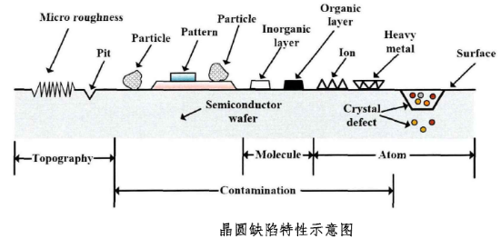

# 晶圆缺陷检测解决“自动追焦”难题

  为完美实现晶圆缺陷检测应用中的快速自动追焦难题，并实现了等间距触发高速相机采集图像，在晶圆缺陷检测领域发挥重要作用。

- 参考文献内容：

  - [vision-systems-china]('read://https_www.vision-systems-china.com/?url=https%3A%2F%2Fwww.vision-systems-china.com%2Fdeitechnology.asp%3Fid%3D17723',"视觉中国")
  - [科研资料](https://opticsjournal.net/Articles/OJ25a74400ed747457/FullText)
  - [虎嗅](https://m.huxiu.com/article/1501520.html)
  - [机器视觉系统在半导体晶圆缺陷检测中的应用](read://https_www.jadak.com.cn/?url=https%3A%2F%2Fwww.jadak.com.cn%2F%3Fcontent%2F325)

