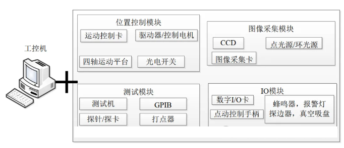
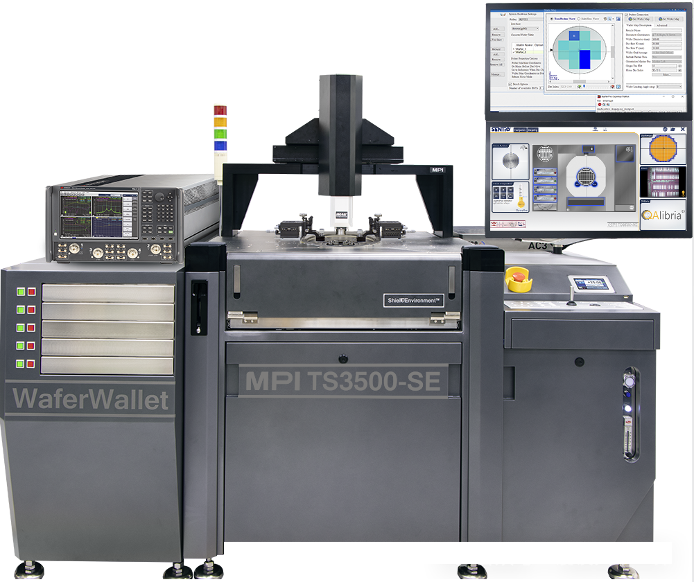
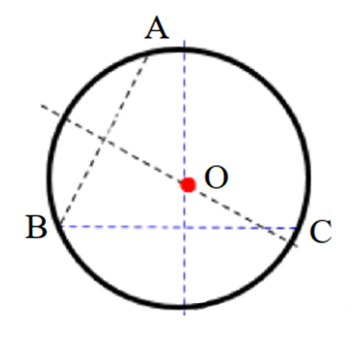

# 晶圆探针台测试系统(1)

## 探针台背景介绍

- 探针台是一种晶圆探针测试设备，探针测试在半导体器件制造流程具有重要的地位，通过探针测试，可及时发现晶圆中性能异常的晶粒，减少后续工序的加工耗费。

- 探针台通过XYZR四轴运动平台移动Chuck台，使探针准确对准并接触晶粒上的焊盘。接着驱动测试机通过探针向被测晶粒施加测试程序。测试机完成测试后，将结果返回给探针台控制程序。探针台保存测试结果，并根据结果对晶粒做相应的标记。

## 1. 探针台测试系统组成 

探针测试系统可大致分为两类：探针台及测试系统，其中探针台又由工控机、位置控制模块、图像采集模块和I/O模块等四部分。

### 位置控制模块

- 该模块主要由运动控制卡(如欧姆龙的CK3M)，四轴运动平台，四个控制电机以及驱动器以及一些光电开关组成。

- 四轴运动平台是自动探针台的主要机械结构，用来实现承片台的水平移动、升降和旋转。

- X轴的水平运动主要用于使承片台准确移动至下一个测试位置，实现晶粒的进给；

- Y轴则主要用于测试过程中的晶粒换行；

- Z轴主要通过控制承片台的高度，控制探针与晶粒焊盘的接触与分离，另外Z轴还可控制CCD的精密对焦；

- R轴可在一定范围内进行旋转，主要用于角度调整，保证晶粒在承片台上的排列与X或Y轴同向。

### I/O模块

- 作用是采集外部传感器的信号或输出外围辅助器件的控制信号。输入信号主要包括点动控制手柄、探边器信号、结束测试信号EOT等；而输出信号主要包括开始测试START信号，测试的TTL结果，真空吸盘、蜂鸣器以及报警灯的控制信号等。

### 图像采集模块

- 作用是采集晶圆及晶粒的图像数据，上位机根据相应的数字图像处理算法自动识别出晶圆的圆心位置，实现对晶粒的模板匹配，并计算出晶粒在Chuck台上的排列方向。

### 测试模块

- 主要由测试机(如V93000等)、探针等部件组成。其中测试机根据特定的通信协议，从上位机接收START（开始测试）、EOT（结束测试）等控制指令，向探针施加测试程序，获取测试结果并发送给上位机。

## 2.CP测试的流程

- 将晶圆片放置在Chuck台上并移动到相机采集图像的位置，根据采集到的图像计算出晶圆的圆心位置，晶粒排列方向，然后旋转Chuck台使晶粒排列方向与X轴同向；

- 测试时移动Chuck台使探针与晶粒焊盘准确接触，上位机向测试机发送开始测试信号，测试机开始测试并将结果返回给上位机，上位机根据测试结果决定是否进行重测或进行打点标记，完成一个晶粒的测试；

- 然后上位机控制Chuck台移动至下一个晶粒位置继续测试；

- 测完一行的晶粒后，向Y轴移动换一行直至测完全部晶粒。

## 3.晶圆中心检测 

- 为了获取到晶圆的中心，可连续在三个不同的位置进行晶圆边界检测，获取三个边界点A、B和C，如下图。然后分别做AB和BC的中垂线，根据三点定圆原理，即可求出晶圆的圆心位置。

- 晶圆边界的提取可分为三部分： 图像二值化、图像腐蚀、边缘提取。

4.晶圆调平

- 晶圆片放到Chuck台上，晶粒排列方向与X轴运动方向存在一个倾角，需要将晶圆摆正，使晶粒的排列方向与X轴同向，这样在进给运动的时候，只需要做X向或Y向运动，简化了探针测试的运动控制。

- 为了计算晶粒方向的倾角，需要确定同一行内两个晶粒位置，计算出两个晶粒的X向位移d和Y向位移Δy，然后用公式tanθ=Δy/d计算出倾角。然后旋转R轴便可以实现晶圆调平。