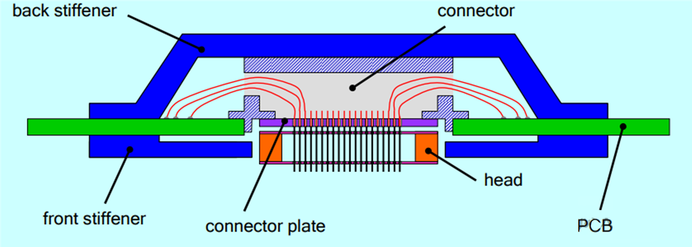
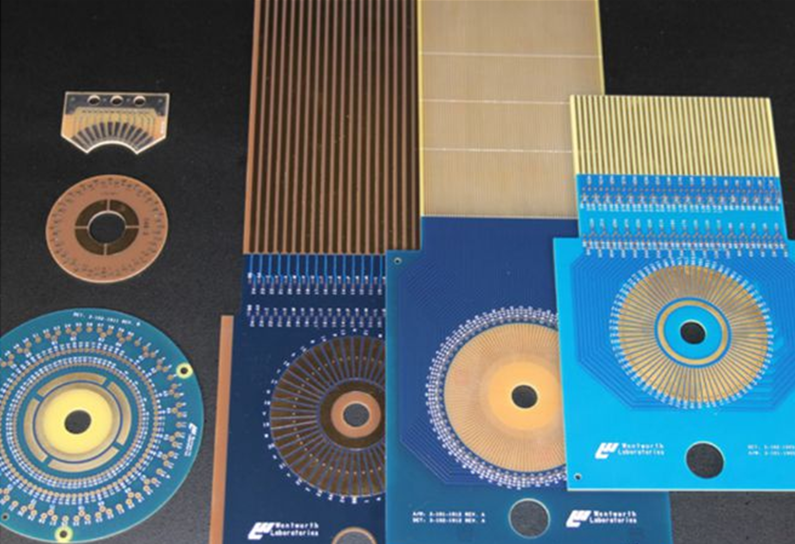

# 晶圆探针台测试系统(1)

## 探针台背景介绍

- 探针台是一种晶圆探针测试设备，探针测试在半导体器件制造流程具有重要的地位，通过探针测试，可及时发现晶圆中性能异常的晶粒，减少后续工序的加工耗费。

- 探针台通过XYZR四轴运动平台移动Chuck台，使探针准确对准并接触晶粒上的焊盘。接着驱动测试机通过探针向被测晶粒施加测试程序。测试机完成测试后，将结果返回给探针台控制程序。探针台保存测试结果，并根据结果对晶粒做相应的标记。

## 1. 探针台测试系统组成 

探针测试系统可大致分为两类：探针台及测试系统，其中探针台又由工控机、位置控制模块、图像采集模块和I/O模块等四部分。


### 位置控制模块

- 该模块主要由运动控制卡(如欧姆龙的CK3M)，四轴运动平台，四个控制电机以及驱动器以及一些光电开关组成。

- 四轴运动平台是自动探针台的主要机械结构，用来实现承片台的水平移动、升降和旋转。

- X轴的水平运动主要用于使承片台准确移动至下一个测试位置，实现晶粒的进给；

- Y轴则主要用于测试过程中的晶粒换行；

- Z轴主要通过控制承片台的高度，控制探针与晶粒焊盘的接触与分离，另外Z轴还可控制CCD的精密对焦；

- R轴可在一定范围内进行旋转，主要用于角度调整，保证晶粒在承片台上的排列与X或Y轴同向。


### I/O模块

- 作用是采集外部传感器的信号或输出外围辅助器件的控制信号。输入信号主要包括点动控制手柄、探边器信号、结束测试信号EOT等；而输出信号主要包括开始测试START信号，测试的TTL结果，真空吸盘、蜂鸣器以及报警灯的控制信号等。

### 图像采集模块

- 作用是采集晶圆及晶粒的图像数据，上位机根据相应的数字图像处理算法自动识别出晶圆的圆心位置，实现对晶粒的模板匹配，并计算出晶粒在Chuck台上的排列方向。

### 测试模块

- 主要由测试机(如V93000等)、探针等部件组成。其中测试机根据特定的通信协议，从上位机接收START（开始测试）、EOT（结束测试）等控制指令，向探针施加测试程序，获取测试结果并发送给上位机。


## 2.CP测试的流程

- 将晶圆片放置在Chuck台上并移动到相机采集图像的位置，根据采集到的图像计算出晶圆的圆心位置，晶粒排列方向，然后旋转Chuck台使晶粒排列方向与X轴同向；

- 测试时移动Chuck台使探针与晶粒焊盘准确接触，上位机向测试机发送开始测试信号，测试机开始测试并将结果返回给上位机，上位机根据测试结果决定是否进行重测或进行打点标记，完成一个晶粒的测试；

- 然后上位机控制Chuck台移动至下一个晶粒位置继续测试；

- 测完一行的晶粒后，向Y轴移动换一行直至测完全部晶粒。


## 3.晶圆中心检测 

- 为了获取到晶圆的中心，可连续在三个不同的位置进行晶圆边界检测，获取三个边界点A、B和C，如下图。然后分别做AB和BC的中垂线，根据三点定圆原理，即可求出晶圆的圆心位置。


- 晶圆边界的提取可分为三部分： 图像二值化、图像腐蚀、边缘提取。

4.晶圆调平

- 晶圆片放到Chuck台上，晶粒排列方向与X轴运动方向存在一个倾角，需要将晶圆摆正，使晶粒的排列方向与X轴同向，这样在进给运动的时候，只需要做X向或Y向运动，简化了探针测试的运动控制。


- 为了计算晶粒方向的倾角，需要确定同一行内两个晶粒位置，计算出两个晶粒的X向位移d和Y向位移Δy，然后用公式tanθ=Δy/d计算出倾角。然后旋转R轴便可以实现晶圆调平。


## 晶圆探针台测试系统(2)

## 晶圆探针台的工作原理

- 晶圆探针台的工作原理是通过一组微型探针与芯片的测试点接触，以实现电信号的传输和测量。这些探针通常由金属材料制成，能够在微米级别的精度下进行定位。探针台的结构包括支架、移动平台、探针和控制系统。


###  探针卡 (Probe Card)

- 探针卡（Probe Card）是晶圆探针台中的关键组件。通过探针与芯片上的焊垫或凸块直接接触，完成测试信号的传输和反馈。


### 探针卡的主要功能包括：

- 连接测试设备与晶圆：作为自动测试设备(ATE)与晶圆之间的接口，便于测试半导体晶圆上的单个电路。
- 电性能测试：在芯片封装前对芯片的电学性能进行初步测量，筛选出不良芯片。
- 信号传输：通过探针与晶圆电路直接相互作用的精细金属触点，测量信号完整性、功率和功能等电气特性。


### 探针卡的核心组件包括：

- 探针（Probe）：探针是探针卡的核心部件，负责与晶圆上的电路直接接触，传输电信号。探针的材料多样，常见的包括钨(W)、铼钨（ReW, 3%R 97%W）、铍铜(BeCu)、P7(P)、钯（Pd）和P8合金等。

- 印刷电路板（PCB）：PCB作为探针卡的基底，提供电路连接和结构支撑。它连接了探针与测试设备，确保测试信号的有效传递。

- 功能部件：可能包括用于信号调节和分配的电子元件，以及其他功能部件，如补强板（Stiffener）以增强其稳定性。



### 探针卡的类型主要包括：

- 悬臂式探针卡（Cantilever Probe Card）:

  - 结构特点：探针呈悬臂状，类似于吊桥，可以伸向晶圆并与晶圆表面接触。悬臂针卡的探针材质包括钨(W)、铼钨（ReW, 3%R 97%W）、铍铜(BeCu)、P7(P)、钯(Pd)和P8合金。
  - 优势：成本较低，适用于较大焊垫或凸块的芯片。
  - 局限性：探针直径较大，可能导致晶圆上的焊垫在多次接触后受损。

- 垂直式探针卡（Vertical Probe Card）:

    - 结构特点：探针垂直排列，与晶圆表面垂直接触，类似于电梯。垂直式探针卡在结构上通常包括探针、探针座、基板、以及外围的- 接口和电路等部分。探针部分的材质通常选用高导电性与良好机械性能的材料，例如钨、钻石镀层或特殊的合金等。
    - 优势：能够容纳更多针脚，适合焊垫或凸块较小的高端芯片，如手机处理器、GPU等。
    - 特点：针痕较浅，适合反复多次测试，探针间距可以做到非常小。
    - MEMS探针卡（MEMS Probe Card）:

- 技术特点：采用微机电系统技术，探针极为精细。

    - 优势：适合非常小间距、高针数的测试需求，具有高度的自动化和一致性。
    - 应用：常用于最先进的半导体工艺，如7nm、5nm的高端处理器或GPU芯片。
    - 特点：精度极高，能够在微米级别的空间内进行探针排布，类似于微型手术刀。

  此外，探针卡的选择取决于被测试芯片的特性，如焊垫或凸块的大小、间距、测试需求（如电流、电压、频率等）以及成本效益。在实际应用中，选择合适的探针卡需要综合考虑上述因素，以及特定的测试环境和目标。例如，在研发阶段，可能会更倾向于使用高精度的MEMS探针卡，以确保测试数据的准确性。而在大规模生产中，可能会更注重成本效益和测试效率，选择悬臂探针卡或垂直探针卡。



随着半导体技术的发展，探针卡的设计也在不断进步，以满足更高密度、更小尺寸芯片的测试需求。MEMS探针卡因其高精度和高密度的特点，尤其适合于先进工艺节点的芯片测试。


# 晶圆探针台测试系统(3)

- VISA和SCPI在测试和测量领域中扮演着核心角色，它们共同使得仪器的通信和控制变得更加标准化和高效。

##  1. VISA（Virtual Instrument Software Architecture）

- VISA是一个独立于平台和通信协议的软件接口标准，由美国国家仪器公司（National Instruments，NI）发起并维护。VISA的主要目的是提供一个统一的编程接口，使得开发者可以无需关心底层硬件和通信协议的细节，就能与各种测试和测量设备进行通信。


- VISA的主要特点包括：

    - 跨平台支持
        ：VISA可以在多种操作系统上运行，如Windows、Linux和macOS。
    - 跨通信协议
        ：VISA支持多种通信协议，包括GPIB、Serial Port、USB、Ethernet等。
    - 资源管理
        ：VISA提供了资源管理功能，可以自动检测和配置仪器资源。

    - 高级功能
        ：VISA提供了一系列高级功能，如并行通信、消息触发、远程控制等。

    VISA通过提供一组标准的函数库，使得开发者可以轻松地在不同的编程语言中实现仪器的控制和数据采集。

    VISA库作为一套软件开发工具包（SDK），提供了一组丰富的函数，用于实现对各种测试和测量仪器的通信和控制。这些函数以动态链接库（DLL）或静态库（Lib）的形式提供，使得开发者可以在不同的编程环境中集成VISA功能。


## 案例: 用C#实现和示波器的通信

- 安装NI-VISA： 确保计算机上安装了NI-VISA库。这是使用VISA函数的基础，可以从National Instruments的官方网站下载并安装。

- 添加VISA库引用： 在C#项目中，您需要添加对VISA库的引用。通常，需要引用以下DLL：

- 这些DLL文件通常位于以下路径之一：

    - 在Visual Studio中，可以通过右键点击项目 -> 添加 -> 引用...，然后浏览到上述路径添加相应的DLL。

            C:\Program Files (x86)\National Instruments\VISA\WinNT\bin\
            C:\Windows\assembly\GAC_MSIL\NationalInstruments.Visa\
            NationalInstruments.Visa.dll
            Ivi.Visa.dll
- 使用VISA命名空间： 在C#代码文件顶部，使用以下命名空间：

``` CSharp
using NationalInstruments.Visa;
``` 

- 创建VISA会话： 创建一个VISA会话来与示波器通信。以下是一个示例代码，展示了如何创建一个会话并与GPIB接口的示波器通信：

``` CSharp
    // 创建VISA会话
    ViStatus status;
    ViSession rmSession, instrSession;
    status = VisaCHandle.CreateInstance("",out rmSession);
    if(status < ViStatus.Success)thrownewVisaException(status);

    // 打开与示波器的会话
    status = ViSession.Open(rmSession,"GPIB0::5::INSTR", ViAccessMode.NoLock, ViTimeout.Infinite,out instrSession);
    if(status < ViStatus.Success)thrownewVisaException(status);
    发送SCPI命令： 使用VISA会话发送SCPI命令到示波器，并接收响应。以下是一个发送“*IDN?”命令的示例：

    // 发送SCPI命令查询示波器标识
    string idn ="*IDN?";
    status = ViSession.WriteString(instrSession, idn.Length, idn);
    if(status < ViStatus.Success)thrownewVisaException(status);

    constint bufferSize =256;
    string response =newstring(newchar[bufferSize]);
    status = ViSession.ReadString(instrSession, bufferSize, response);
    if(status < ViStatus.Success)thrownewVisaException(status);

    Console.WriteLine("示波器响应: "+ response);
    关闭VISA会话： 完成通信后，关闭与示波器的会话，并释放资源：

    // 关闭会话
    ViSession.Close(instrSession);
    VisaCHandle.DestroyInstance(rmSession);
```

- 请注意，上述代码中的"GPIB0::5::INSTR"是示波器的VISA地址，其中"GPIB0"是GPIB接口板的名称，"5"是示波器连接到GPIB接口板的地址。如果示波器使用其他接口（如USB或Ethernet），则需要使用相应的VISA地址格式。

- 以上步骤展示了如何在C#项目中引用和使用VISA库。确保开发环境配置正确，并且已经安装了必要的NI-VISA库版本。这样，就可以在C#中轻松地与各种测试和测量设备进行通信了。

## 2. SCPI（Standard Commands for Programmable Instruments） 

    SCPI是一种标准化的命令语言，用于控制和查询测试和测量设备的状态。SCPI命令基于ASCII编码，遵循IEEE 488.2标准，并且可以在多种通信协议上实现。SCPI的主要特点包括：

- 标准化：SCPI提供了一套标准化的命令集，使得不同厂商的设备可以通过统一的命令进行控制。
- 树状结构：SCPI命令采用树状结构，使得命令的组织和记忆更加直观。
- 功能区分：SCPI命令分为控制命令（用于改变设备状态）和查询命令（用于获取设备状态）。
- 参数化：SCPI命令可以包含参数，以实现更灵活的设备控制。
- SCPI使得开发者可以通过发送简单的文本命令来控制仪器，这些命令在不同的设备和厂商之间具有很高的一致性。

### 示例：OUTPut子系统

- SCPI命令采用树状结构，以下是OUTPut子系统的一部分示例：

``` OUTPut
OUTPut:
  SYNC {OFF|0|ON|1}
  SYNC:
    MODE {NORMal|CARRier}
    POLarity {NORMal|INVerted}
```

- 在这个例子中，OUTPut 是根级关键字，SYNC 是第二级关键字，而 MODE 和 POLarity 是第三级关键字。冒号(:)用于分隔不同级别的关键字。

- 例如设置或读取电源电流值

    [SOURce:]CURRent[:LEVel][:IMMediate][:AMPLitude] <NRf>

- 设置电流

    SOURce:CURRent:LEVel:IMMediate:AMPLitude 5.0

- 这条命令将电流设置为5.0安培。

- 查询电流

    SOURce:CURRent:LEVel:IMMediate:AMPLitude?

- 这条命令查询当前设置的电流值。

    这些例子展示了如何使用SCPI命令来控制和查询仪器的状态。在实际应用中，您需要根据具体的仪器和需求来构造和发送相应的SCPI命令。

## 3. VISA与SCPI的关系
- VISA和SCPI经常一起使用，但它们在测试和测量系统中扮演不同的角色：

    - VISA 提供了与仪器通信的底层接口和工具，而 SCPI 提供了用于控制仪器的标准化命令集。
    - VISA抽象了通信协议和硬件平台的差异，而SCPI抽象了仪器操作的差异。
    - 开发者可以使用VISA库函数来发送SCPI命令，从而控制仪器。

    总的来说，VISA和SCPI共同为测试和测量领域提供了一个强大而灵活的通信和控制框架，使得开发者可以更加专注于应用层的开发，而不是底层的通信细节。