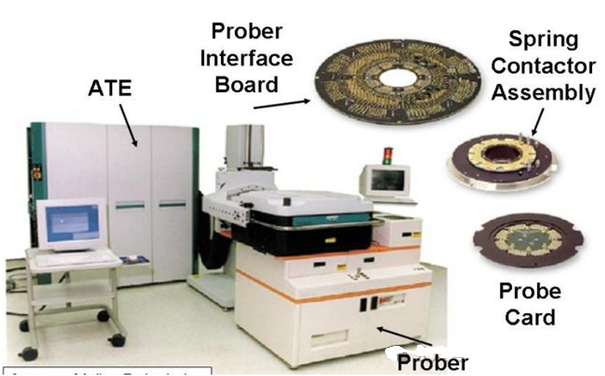
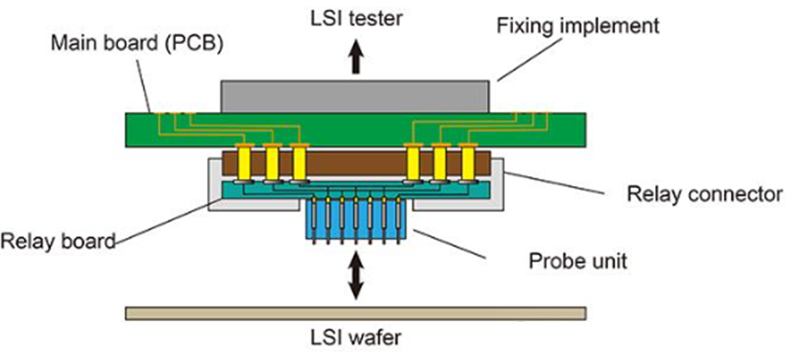
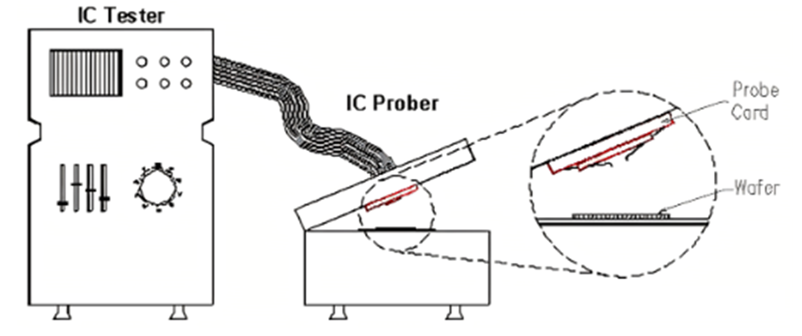
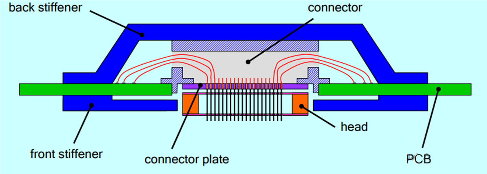
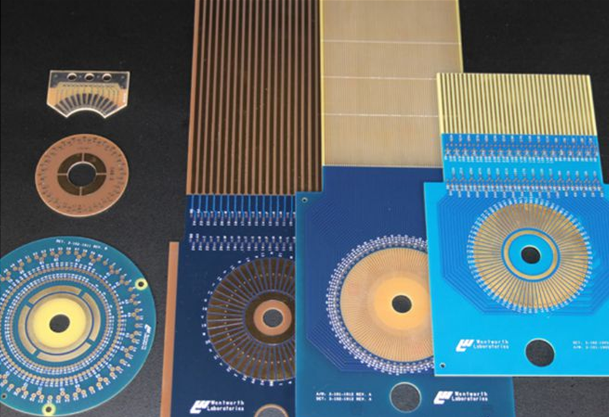

## 晶圆探针台测试系统(2)

## 晶圆探针台的工作原理

- 晶圆探针台的工作原理是通过一组微型探针与芯片的测试点接触，以实现电信号的传输和测量。这些探针通常由金属材料制成，能够在微米级别的精度下进行定位。探针台的结构包括支架、移动平台、探针和控制系统。

###  探针卡 (Probe Card)

- 探针卡（Probe Card）是晶圆探针台中的关键组件。通过探针与芯片上的焊垫或凸块直接接触，完成测试信号的传输和反馈。

### 探针卡的主要功能包括：

- 连接测试设备与晶圆：作为自动测试设备(ATE)与晶圆之间的接口，便于测试半导体晶圆上的单个电路。
- 电性能测试：在芯片封装前对芯片的电学性能进行初步测量，筛选出不良芯片。
- 信号传输：通过探针与晶圆电路直接相互作用的精细金属触点，测量信号完整性、功率和功能等电气特性。

### 探针卡的核心组件包括：

- 探针（Probe）：探针是探针卡的核心部件，负责与晶圆上的电路直接接触，传输电信号。探针的材料多样，常见的包括钨(W)、铼钨（ReW, 3%R 97%W）、铍铜(BeCu)、P7(P)、钯（Pd）和P8合金等。

- 印刷电路板（PCB）：PCB作为探针卡的基底，提供电路连接和结构支撑。它连接了探针与测试设备，确保测试信号的有效传递。

- 功能部件：可能包括用于信号调节和分配的电子元件，以及其他功能部件，如补强板（Stiffener）以增强其稳定性。

### 探针卡的类型主要包括：

- 悬臂式探针卡（Cantilever Probe Card）:

  - 结构特点：探针呈悬臂状，类似于吊桥，可以伸向晶圆并与晶圆表面接触。悬臂针卡的探针材质包括钨(W)、铼钨（ReW, 3%R 97%W）、铍铜(BeCu)、P7(P)、钯(Pd)和P8合金。
  - 优势：成本较低，适用于较大焊垫或凸块的芯片。
  - 局限性：探针直径较大，可能导致晶圆上的焊垫在多次接触后受损。

- 垂直式探针卡（Vertical Probe Card）:

    - 结构特点：探针垂直排列，与晶圆表面垂直接触，类似于电梯。垂直式探针卡在结构上通常包括探针、探针座、基板、以及外围的- 接口和电路等部分。探针部分的材质通常选用高导电性与良好机械性能的材料，例如钨、钻石镀层或特殊的合金等。
    - 优势：能够容纳更多针脚，适合焊垫或凸块较小的高端芯片，如手机处理器、GPU等。
    - 特点：针痕较浅，适合反复多次测试，探针间距可以做到非常小。
    - MEMS探针卡（MEMS Probe Card）:

- 技术特点：采用微机电系统技术，探针极为精细。

    - 优势：适合非常小间距、高针数的测试需求，具有高度的自动化和一致性。
    - 应用：常用于最先进的半导体工艺，如7nm、5nm的高端处理器或GPU芯片。
    - 特点：精度极高，能够在微米级别的空间内进行探针排布，类似于微型手术刀。

  此外，探针卡的选择取决于被测试芯片的特性，如焊垫或凸块的大小、间距、测试需求（如电流、电压、频率等）以及成本效益。在实际应用中，选择合适的探针卡需要综合考虑上述因素，以及特定的测试环境和目标。例如，在研发阶段，可能会更倾向于使用高精度的MEMS探针卡，以确保测试数据的准确性。而在大规模生产中，可能会更注重成本效益和测试效率，选择悬臂探针卡或垂直探针卡。

随着半导体技术的发展，探针卡的设计也在不断进步，以满足更高密度、更小尺寸芯片的测试需求。MEMS探针卡因其高精度和高密度的特点，尤其适合于先进工艺节点的芯片测试。