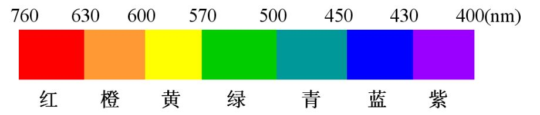
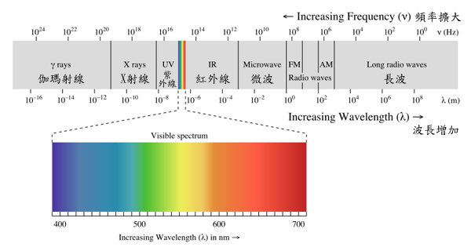
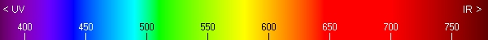

# 可见光的波长与频率对照表

## 信息摘要：
- 可见光的色散谱根据波长依次为红、橙、黄、绿、青、蓝、紫。对应的波长（频率）在下表中列出。绿光波长为500-560nm，黄光波长为580-595nm。

## 绿光波长为500-560nm，黄光波长为580-595nm

## 不同波长的可见光所对应的不同颜色。

- 声波的频率范围0.0001Hz～10^12Hz以上,人耳可以听到的频率范围20Hz-20000Hz,把（20000Hz～10^12Hz以上）的声音称为超声波,把（0.0001Hz～20Hz）的声音称为次声波.可见光的波段频率范围是3．9×10^14到7．7×10^14赫兹,紫外线的波段频率范围大致在8×10^14到3×10^17赫兹之间,而红外线波长的范围大致在3×10^11到约4×10^14赫兹之间.

- 光波是电磁波,声波是机械波.光波（即电磁波的可见光谱）的速度为每秒30万公里,声波的速度为每秒 340米,人的视觉神经的传递速度为每秒1200～1400米,人的听觉神经的传递速度为每秒 800～1200米.声波与光波的更大的区别在于前者需要介质,而后者不需要.声波的多普勒效应与波源、介质及观察者三者之间的相互运动有关.而光波因为没有介质,光的多普勒效应只涉及光源与观察者之间的相对运动。

- 换一个角度来讲,可以说光在真空中的传播也是通过某种介质,但这种介质有一个非常特殊的性质,它相对于所有的惯性参照系的运动速度都为零.正是这个特征,使得“光速与光源的运动速度无关”与“光速与观察者的运动速度无关”等价.而声波的传播媒介(空气、水等)都不具备这种“永远静止”的性质,故不存在“声速不变原理”,也无法由此导出相对论.另外,光波也能在非真空介质(如玻璃等)中传播,但是这些介质也不具备这种 “永远静止”的性质,所以也不能用光波在这类介质中的传播速度替代相对论中的光速。

- 可见光的色散谱根据波长依次为红、橙、黄、绿、青、蓝、紫。对应的波长（频率）在下表中列出。

## 可见光的波长与频率对照表

- 名称	波长（纳米）	频率（兆赫）
- 紫光波长	400~435	790-680
- 蓝光波长	450~480	680-620
- 青光波长	480~490	600-620
- 绿光波长	500~560	600-530
- 黄光波长	580~595	530-510
- 橙光波长	595~605	510-480
- 红光波长	605~700	480-405

- 光通过材料后，其强度或多或少地会减弱，实际上就是一部分光能量被固体吸收。而对材料施加外界作用，如加电磁场等激发，有时会产生发光现象。这里涉及两个相反的过程：光吸收和光发射。

- 光吸收：光通过固体时，与固体中存在的电子、激子、晶格振动及杂质和缺陷等相互作用而产生光的吸收。

- 光发射：固体吸收外界能量，其中一部分能量以可见光或近于可见光的形式发射出来。

## 激光波长是指什么？

- 激光波长是指激光器的输出波长，是激光器输出激光光束的重要参数。相应输出的频率叫激光频率。

- 其实,激光也是一种电磁波,只是激光的波长与无线电波不在一一个数量级,它比无线电波短好多个数量级。激光的波长单位通常用nm ( 1/1000000000米)来度量,而激光又可以分为可见激光和不可见激光两大类。一般情况下，人眼能够清晰分辨的可见光波长基本在400纳米到700纳米之间。激光的波长越短，它的颜色越蓝越紫，直到人眼看不见的紫外线。然而，波长越长，它的颜色越偏向红色，直到人眼看不见的红外线。人眼对波长在550-570纳米之间的绿色、橙色和黄色光线最为敏感。因此，在可见光范围内，波长可以理解为颜色的数字标识。

- 激光可见光束颜色波长从短到长依次为： 蓝紫色（375nm，405nm），蓝光（445nm，488nm），绿光（520nm，532nm），黄光（589nm,577nm）和红光（635nm，650nm）；在这块波长范围内的激光通常会在以舞台表演及医疗的领域应用到。

## 各种波长的光对植物的影响

1、光谱范围 对 植物生理的影响
- 280 ~ 315nm： 对形态与生理过程的影响极小
- 315 ~ 400nm ：叶绿素吸收少，影响光周期效应，阻止茎伸长
- 400 ~ 520nm（蓝光）：叶绿素与类胡萝卜素吸收比例更大，对光合作用影响更大
- 520 ~ 610nm（绿光）：色素的吸收率不高
- 610 ~ 720nm（红光）：叶绿素吸收率低，对光合作用与光周期效应有显著影响
- 720 ~ 1000nm ：吸收率低，刺激细胞延长，影响开花与种子发芽
- ＞1000nm ： 转换成为热量

2、从上面的数据来看，植物光合作用需要的光线，波长在400 ~ 720nm左右。440 ~ 480nm（蓝色）的光线以及640 ~ 680nm（红光）对于光合作用贡献更大。520 ~ 610nm（绿色）的光线，被植物色素吸收的比率很低。

3、按照以上原理，植物灯基本都是做成红蓝组合、全蓝、全红三种形式，覆盖光合作用所需的波长范围。在视觉效果上，红蓝组合的植物灯呈现粉红色。特别指出白光对光合作用同绿光类似，也无作用

4、植物灯的红蓝灯光色谱比例一般在5：1 ~ 10：1之间为宜，通常可选7 ~ 8：1的比例。当然有条件的可根据植物生长周期调整红色和蓝色光的比例更好。

5、用植物灯给植物补光时，一般距离叶片的高度为0.5 ~ 1米

## 波长的定义

- 沿着波的传播方向，在波的图形中相对平衡位置的位移时刻相同的两个质点之间的距离。 横波与纵波的波长——在横波中波长通常是指相邻两个波峰或波谷之间的距离。在纵波中波长是指相邻两个密部或疏部之间的距离。波长在物理中表示为：λ，读作“喃穆达”。右图是电磁波的波长范围及名称。从图中可以看出，光波是指波长从零点几毫米到大约零点一微米波长范围内的电磁波。

## 频率的定义

- 频率，是单位时间内完成振动的次数，是描述振动物体往复运动频繁程度的量，常用符号f或v表示，单位为秒-1。为了纪念德国物理学家赫兹的贡献，人们把频率的单位命名为赫兹，简称“赫”。每个物体都有由它本身性质决定的与振幅无关的频率，叫做固有频率。频率概念不仅在力学、声学中应用，在电磁学和无线电技术中也常用。交变电流在单位时间内完成周期性变化的次数，叫做电流的频率。

## 波长与频率的关系

- 波长与频率的关系是它们之间成反比, 具体的公式要看是什么波在什么传输媒介中传波,例如,光的波长=光速*(1/频率) 光速单位是米每秒, 不同颜色的光谱有不同的频率。

- v=fλ   对任何情况恒成立

- 当中的v是波传送的速度。在电磁波的例子，例如光在真空中的速度，亦即光速，是299,792,458 m/s（准确），一般写为3*10^8m/s。对于声波在空气中传播的速度，在室温大约是344 m/s（即1238 km/h）。

- 波长的单位一般是米及其导出单位；而频率的单位是赫兹（Hz）及其导出单位。