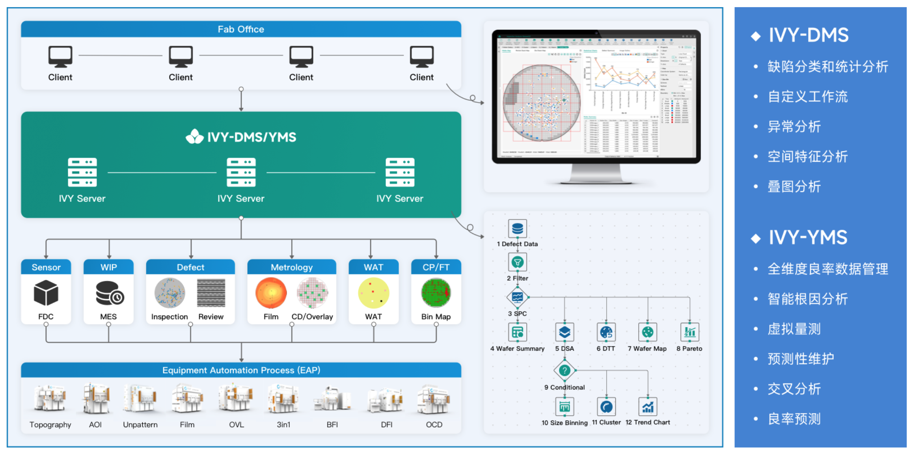

# 基于Skyverse @ Klarity 的良率管理系统

这份文件介绍了一款名为 IVY-DMS/YMS 的良率管理系统软件，主要用于半导体制造领域的良率分析和提升。以下是文件的主要内容：

**产品介绍：**

IVY-DMS/YMS 是一款用于分析检测、量测等良率相关数据的工具。它利用统计分析和机器学习方法，以及定制化的工作流，生成丰富的良率报表，为工程师提供决策支持。该系统能够及时发现产线异常状态，协助 PIE、YE、PE 和 AOI 等工程师分析产线良率下降的原因，从而有效地提升半导体制造良率和产品性能。

**系统架构和功能：**

文件中的示意图展示了 IVY-DMS/YMS 的系统架构，包括客户端、服务器端以及与各种生产设备的连接。主要功能包括：

*   **IVY-DMS：**
    *   缺陷分类和统计分析
    *   自定义工作流
    *   异常分析
    *   空间特征分析
    *   叠图分析
*   **IVY-YMS：**
    *   全维度良率数据管理
    *   智能根因分析
    *   虚拟量测
    *   预测性维护
    *   交叉分析
    *   良率预测

系统通过与各种设备（如传感器、WIP、缺陷检测设备、量测设备、WAT 测试设备、CP/FT 测试设备等）连接，获取生产过程中的各种数据，包括 FDC 数据、MES 数据、检测数据、薄膜 CD/Overlay 数据、WAT 数据、Bin Map 数据等。然后，通过 IVY 服务器进行数据处理和分析，最终以报表的形式呈现给用户。

**产品特点：**

文件还列出了 IVY-DMS/YMS 的主要特点：

1.  **简单易用的 IVY 界面：**支持拖拽分析、动态布局和高度自定义，满足用户的个性化需求。
2.  **Browser/Server 架构：**支持快速迭代和定制开发，轻松应对各种场景需求。
3.  **GPU 运算与分布式架构：**确保 7x24 不间断运行，并能流畅分析百万缺陷数据。
4.  **机器学习与深度学习模型：**结合大数据分析，为根因分析、预测性维护和虚拟量测提供全方位解决方案。
5.  **数据安全无忧：**采用集群方案，具有负载均衡、数据备份与恢复功能，确保系统的稳定与可靠。
6.  **依据各类数据建立 AI 模型：**预测产品良率，助力良率提升。
7.  **节省 80% 以上人力：**自动化监控与良率分析助力企业效益增长。

总而言之，这份文件旨在推介一款功能强大的半导体良率管理系统软件，通过提供全面的数据分析和智能化功能，帮助半导体制造商提高生产效率和产品质量。

