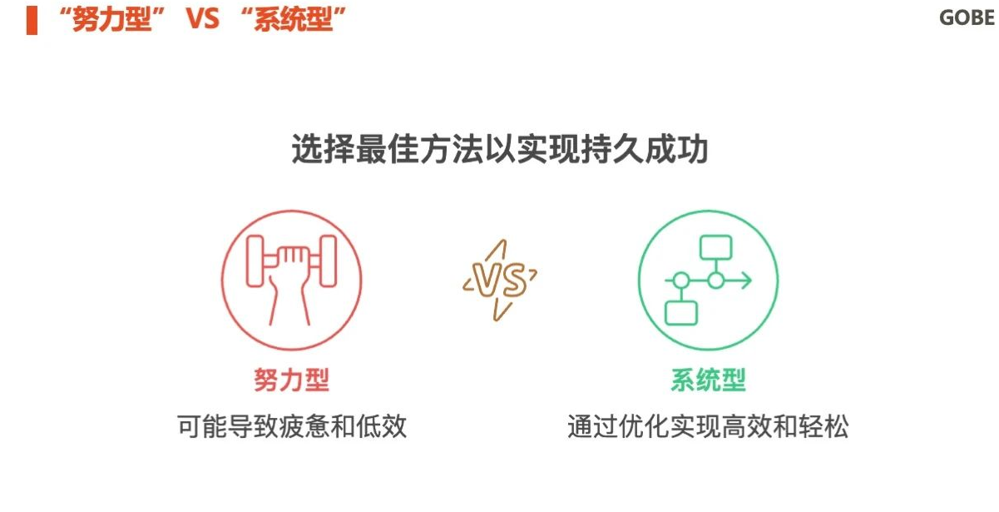

# 成为系统：用“系统”代替“努力”

你有没有发现，很多时候我们在拼命努力，却总是难以坚持下去？就像在跑步机上拼命跑，虽然全力以赴，却始终离终点遥不可及。这种“努力型”状态，大多数人都有过体验，但要是真的能靠单纯的意志力达到目标，为什么还有那么多人在为目标而奋斗却始终没能实现呢？

今天，想跟你聊聊如何从“努力”转变为“系统”，用更聪明的方法去达到目标，而不是单纯依赖体力与意志力的消耗。“努力型”VS“系统型”：谁能更持久？

努力，是每个人都能理解的概念。我们常常把它视为通往成功的唯一路径：“我很努力，我一定会成功！”但是你发现了吗？尽管努力看起来很高效，但它却很容易被拖延、干扰和倦怠消耗殆尽。尤其是当面对繁重的任务时，单靠意志力支撑起来的动力往往是短暂的，且容易中断。

而系统呢？它是背后的一种机制、一种思维方式。它不会依赖于瞬间的情绪波动，而是通过优化环境、流程和习惯，把繁杂的任务变得简单而高效。举个例子，很多成功人士或行业顶尖高手，并非通过拼尽全力去完成每一项任务，而是通过构建一个自动化的系统，让事情自然流动、顺畅运行。这种系统，就像是一个隐形的助推器，让你在不费力的情况下，自动完成目标。

低阻力系统：让行动变得轻松

- 你可能会问，怎样的系统才能真正代替“努力”呢？其实，从高手的做事模式来看，“低阻力系统”是关键。低阻力系统就是通过减少不必要的拖延、干扰和耗费精力的步骤，让目标达成变得更加轻松和自然。
    - （1）工作用品提前准备好，随时可以开始
        你有没有遇到过这样一种情况？每次开始工作都要花费几分钟寻找文件、开软件、整理资料，最后却发现已经浪费了宝贵的时间。这种情况听起来很小，但日积月累，这些碎片化的时间浪费会积成大山。
        
        聪明的人早已通过系统化的方式，提前准备好一切工作所需的材料，工具摆放整齐，甚至工作区的环境都能帮助他们快速进入状态。你可以设想一下，明天早上你刚起床，桌面上已经摆放好你需要的文件、资料和设备，工作一开始就能够迅速进入“流畅”状态。是不是想想就觉得轻松？
    
    - （2）设置场景触发器，一到位置自动进入状态
        有些工作非常容易分心，而分心的根源往往是环境不合适或者没有明确的“启动”信号。你可以设置一些触发器——比如一旦坐到桌前，就自动进入工作状态；一到某个地点，就自动开始阅读或者思考。
        以餐厅主厨为例：每当他走进厨房，所有的流程都已经预设好了——材料提前准备好，刀具整齐排列，烹饪的步骤和流程都已经标准化。无需花太多时间思考和选择，所有的工作都会自然而然地展开。
    
    - （3）删除干扰源，让注意力集中
        在信息爆炸的时代，干扰源太多，想要集中精力几乎成了一项奢侈品。但这正是系统的强大之处。通过删除不必要的干扰，比如关闭不必要的社交媒体，设置工作时段内的免打扰模式，优化工作环境，创造一个专注的“战斗空间”，你就能让自己更加高效，少走弯路。
    
- 写在最后：用“系统”取代“努力”如果你仍然把“努力”当作成功的唯一途径，那么很可能会感到越来越疲惫，甚至陷入困境。与其不断逼迫自己去“努力”，不如通过建立系统，优化流程，降低不必要的阻力。正如餐厅的主厨，熟练的操作和标准化的流程让他能够轻松完成复杂的任务，而你同样可以通过系统化的思维，让自己在工作、学习、生活中游刃有余。从今天开始，不是盲目地去努力，而是开始思考如何让自己的工作和生活变成一套低阻力的系统，让你轻松达到目标，事半功倍。“努力”并非不重要，但它不应该是唯一的驱动力。通过“系统”，你会发现，成功可以变得更加简单、高效和持久。